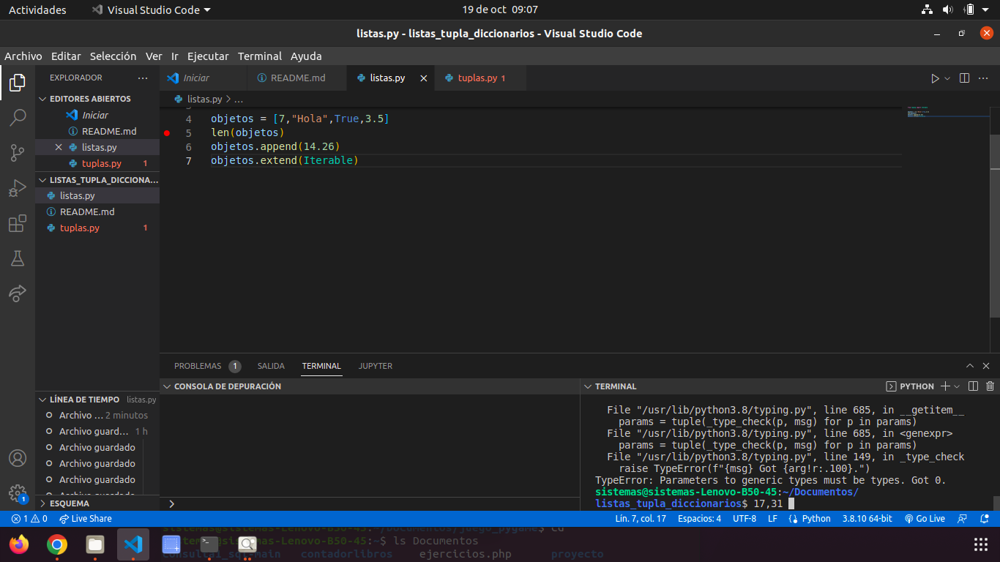
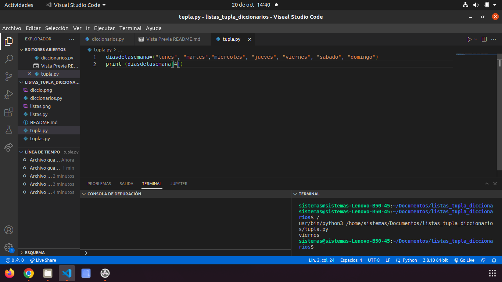
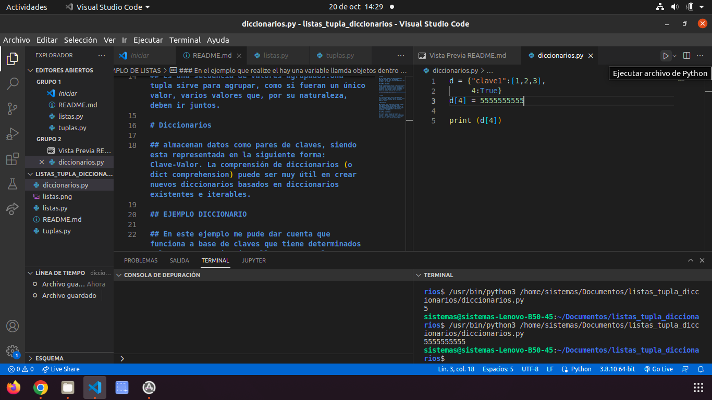

# Listas

## son un tipo de dato que permite almacenar datos de cualquier tipo. Son mutables y dinámicas, lo cual es la principal diferencia con los sets y las tuplas.

## EJEMPLO DE LISTAS

### En el ejemplo que realize el hay una variable llamda objetos dentro de ella hay unos objetos, que pueden ser modificados a base de codigos, por ejemplo se puede agregar o quitar determinado objeto que quieras modificar de la variable

# Tuplas 

## Es una secuencia de valores agrupados.Una tupla sirve para agrupar, como si fueran un único valor, varios valores que, por su naturaleza, deben ir juntos.

### EJEMPLO DE TUPLAS

### Nos permite escoger determinado dato de un grupo, al hacerle print y poner la ubicacion del dato pues lo cojera.

# Diccionarios

## almacenan datos como pares de claves, siendo esta representada en la siguiente forma: Clave-Valor. La comprensión de diccionarios (o dict comprehension) puede ser muy útil en crear nuevos diccionarios basados en diccionarios existentes e iterables.

## EJEMPLO DICCIONARIO

## En este ejemplo me pude dar cuenta que funciona a base de claves que tiene determinados valores, y que si quiero llamar a un valor por decir asi lo llamara de una manera rapida.

